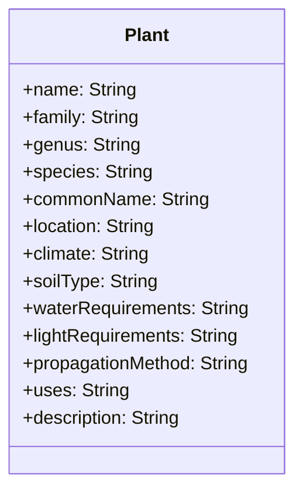
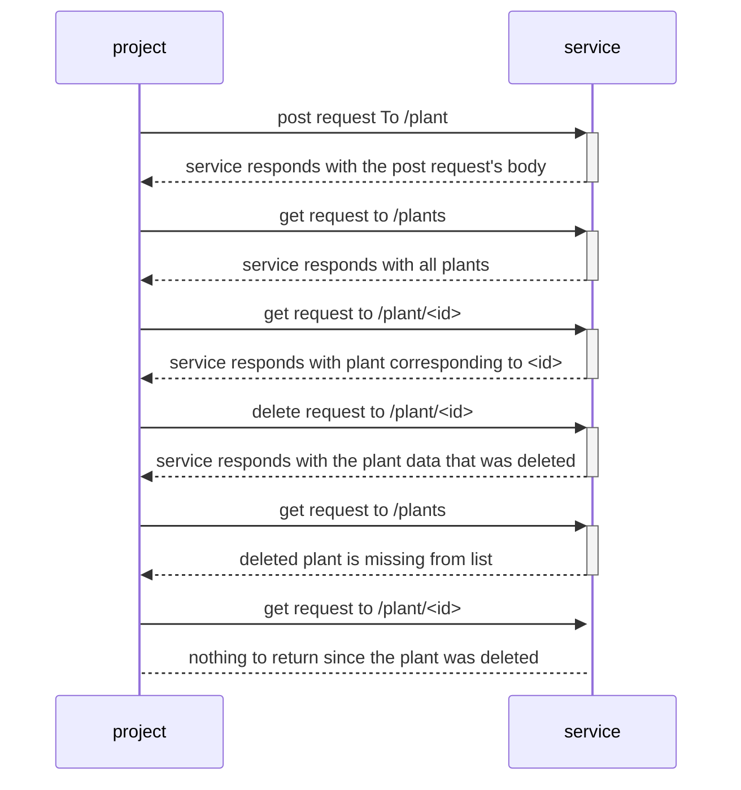

# Project Setup
- `git clone https://github.com/wnelson01/sproutspot.git`
- `cd sproutspot`
- `npm install`
- `echo 'DATABASE_URL="file:./dev.db"' > .env` to let prisma know where to create the sqlite database
- run `npx prisma migrate dev --name init` to create the database
- run `npx ts-node app.ts` (or `npx nodemon app.ts`) to start the server locally on port 3000
- the database contents can be viewed locally by running `npx prisma studio`

# Example Requests    
## Post
    curl -X POST \
    http://localhost:3000/plant \
    -H 'Content-Type: application/json' \
    -d '{
        "name": "Ponytail Palm",
        "family": "Agavaceae",
        "genus": "Beaucarnea",
        "species": "Beaucarnea recurvata",
        "commonName": "Ponytail Palm",
        "location": "Indoor, outdoor",
        "climate": "Desert",
        "soilType": "Well-draining, sand-based soil",
        "waterRequirements": "Infrequent watering, every 2-3 weeks",
        "lightRequirements": "Bright, indirect light",
        "propagationMethod": "Offsets or seed",
        "uses": "Ornamental, air purification",
        "description": "Ponytail Palm, also known as Elephant's Foot, is a desert plant known for its distinctive, balloon-like trunk and long, delicate leaves. It is a low-maintenance plant and can be grown both indoors and outdoors. Its water-storing trunk also makes it tolerant to drought conditions."
    }'

## Get
Navigate to `http://localhost:3000/plants` to get all plants or `http://localhost:3000/plant/:id` to get a single plant

## Delete
    curl -X DELETE http://localhost:3000/plant/:id

# Plant Schema

# UML Sequence

