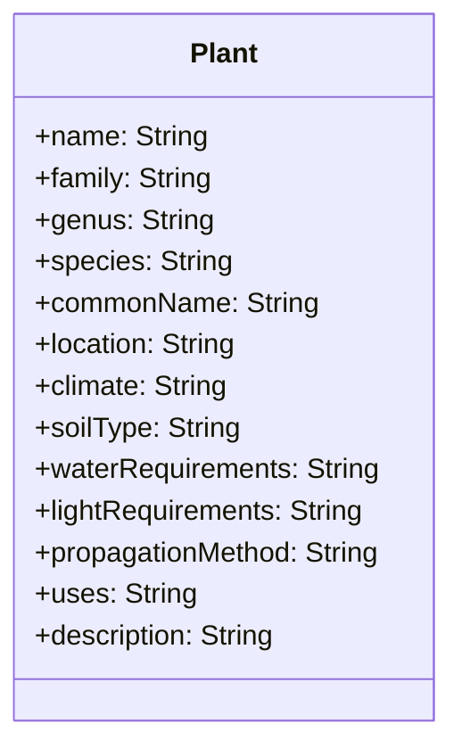
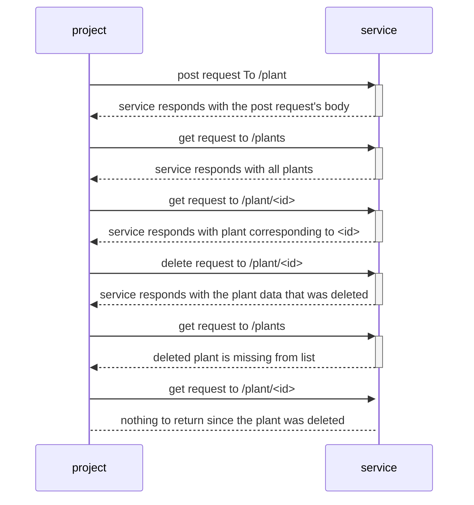

# Project Setup
- `git clone https://github.com/wnelson01/sproutspot.git`
- `cd sproutspot`
- `npm install`
- `echo 'DATABASE_URL="file:./dev.db"' > .env` to let prisma know where to create the sqlite database
- run `npx prisma migrate dev --name init` to create the database
- run `npx ts-node scripts/seed.ts` to populate the database with some starting data 
- run `npx ts-node app.ts` to start the server locally on port 3000

# Example Requests    
## Post
    curl -X POST \
    http://localhost:3000/plant \
    -H 'Content-Type: application/json' \
    -d '{
        "name": "Pothos",
        "family": "Araceae",
        "genus": "Epipremnum",
        "species": "Epipremnum aureum",
        "commonName": "Golden Pothos",
        "location": "Indoor, low light",
        "climate": "Tropical, subtropical",
        "soilType": "Well-draining, humus-rich soil",
        "waterRequirements": "Regular watering, once a week",
        "lightRequirements": "Indoor, low light",
        "propagationMethod": "Stem cuttings",
        "uses": "Ornamental",
        "description": "Pothos, also known as Golden Pothos, is a tropical plant known for its long, trailing vines and heart-shaped leaves. It is often grown as a houseplant due to its tolerance for low light conditions."
    }'
## Get
Navigate to `http://localhost:3000/plants` to get all plants or `http://localhost:3000/plant/:id` to get a single plant

## Delete
    curl -X DELETE http://localhost:3000/plant/:id

# Plant Schema

# UML Sequence

